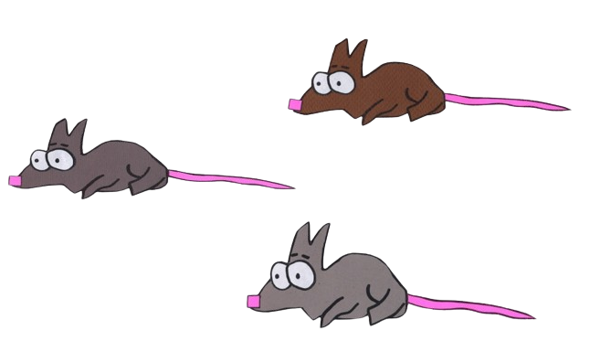

# 🏔️ O Jogo do Park 
# 

>Seja bem-vindo(a) ao projeto: "O Jogo do Park", que consiste em um jogo de plataforma ambientado no universo da animação: "South Park", nesse game o seu objetivo é sobreviver o maximo de tempo que conseguir! E para provar sua bravura você deve eliminar cada inimigo que aparecer em sua frente, podendo consquistar assim seu melhor recorde.

### ❓ Como jogar:

Para jogar basta utilizar os seguintes comandos:

* **` W `** = PULAR

* **` A `** = ANDAR ESQUERDA

* **` D `** = ANDAR DIREITA

* **`ESPAÇO`** = ATIRAR 

### ⚙️ Mecânica:

>A cada inimigo que o jogador derrota, ele recebe 10 pontos que ficam registrados no seu **`SCORE`**, quando a rodada termina o jogador insere o seu apelido que logo em seguida é enviado para um Banco de Dados Relacional, onde é possivel vizualizar a pontuação de cada jogador em cada rodada

### 👾 Confira o jogo!
> Somente para dispostivos Desktop

[O Jogo do Park || Clique para jogar!](https://ojogodopark.netlify.app/)

# 🔎 Conheçendo o game

# 🃏 Personagens:

## JOGADOR

>fdfdfd

### RATOS

>dsfsfs

### ZUMBIS

>dsfsfs
