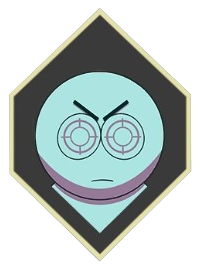
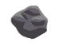
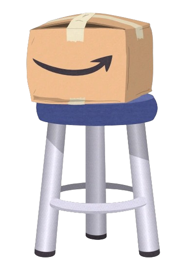
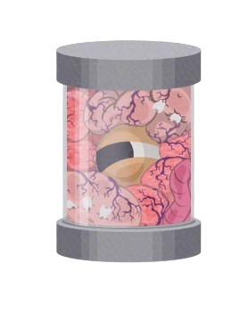

# 🏔️ O Jogo do Park 
# 

>Seja bem-vindo(a) ao projeto: "O Jogo do Park", que consiste em um jogo de plataforma ambientado no universo da animação: "South Park", nesse game o seu objetivo é sobreviver o maximo de tempo que conseguir! E para provar sua bravura você deve eliminar cada inimigo que aparecer em sua frente, podendo consquistar assim seu melhor recorde.

### ❓ Como jogar:

Para jogar basta utilizar os seguintes comandos:

* **` W `** = PULAR

* **` A `** = ANDAR ESQUERDA

* **` D `** = ANDAR DIREITA

* **`ESPAÇO`** = ATIRAR 

### ⚙️ Mecânica:

>A cada inimigo que o jogador derrota com as pedras, ele recebe 10 pontos que ficam registrados no seu **`SCORE`**, quanto mais pontos o jogador vai fazendo mais a dificuldade do jogo aumenta. Por fim, quando a rodada termina o jogador insere o seu apelido que logo em seguida é enviado para um Banco de Dados Relacional, onde é possivel vizualizar a pontuação de cada jogador em cada rodada.

### 👾 Confira o jogo!
> Somente para dispostivos Desktop

[O Jogo do Park || Clique para jogar!](https://ojogodopark.netlify.app/)

# 🔎 Conheçendo o game

## 🕹️ Personagens:
> A seguir uma breve explicação sobre os personagens do jogo, onde aborda algumas curiosidades e o visual de cada um.

* ## JOGADOR

> O jogador é o responsável por protagonizar a aventura do game! Seu design foi feito de forma original especificamente para o jogo;

* ## RATOS

> Os Ratos são os primeiros inimigos que você vai avistar, eles são muito rápidos então tome cuidado! Eles não podem ser destruidos inicialmente no jogo, e possuem também a mêcanica de empurrar qualquer personagem;

* ## ZUMBIS

> Os Zumbis são os seus principais inimigos! Eles não param de spawnar no park, então você deve elimina-los. A cada Zumbi eliminado você recebe 10 pontos ao seu **`SCORE`**;

## 🧩 Elementos:
> A seguir uma breve explicação sobre os elementos presente no jogo, onde aborda suas funcionalidades e o visual de cada um.

* ## POWERUP

> É encostando aqui que o jogador vai receber sua incrível arma de batalha.....uma pedra, simples mas bem eficaz!

* ## PEDRA

> Se equipe e conheça a sua principal arma de batalha! Capaz de eliminar desde ratos até zumbis :O

* ## BANCO

> Um simples banco para você acessar a parte superior do mapa, porém o jogador ao encostar no banco acaba ativando um recurso muito interessante...jogue agora mesmo para descobrir!;

* ## SPAWN

> É graças a esse objeto não identificado que o zumbis estão spawnando! Não é possível destrui-lo e cuidado para não relar nele!;

# 🎲 Conexão com Banco de Dados:

Nesse projeto, os dados coletados dentro do jogo como: **`SCORE`** e **`APELIDO`** , são armazenados em um banco de dados, com base em PHP

* A seguir um exemplo do funcionamento do banco:

https://github.com/henriqueflorentino/jogo_integradoaoBD/assets/94813609/af1c5a29-e639-444b-bfbb-bf7a86ce236c
> Nesse vídeo podemos ver que a conexão do jogo com o banco de dados está funcionando! Aqui é mostrado também registros antigos de outros jogadores.

# 🎬 Gameplay do jogo:

https://github.com/henriqueflorentino/jogo_integradoaoBD/assets/94813609/19ebf1ac-1cc0-4985-9d28-06fc7818b9e0
> Nesse vídeo podemos ver a gameplay do jogo com todas as funcionalidades em funcionamento!
